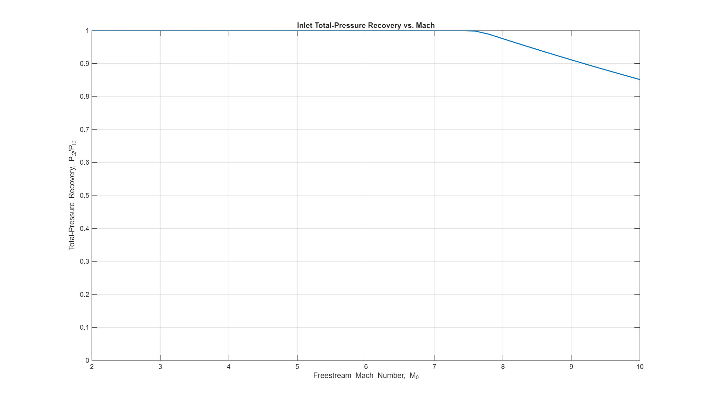

## 2b  Scramjet Cycle @ M8
* Equations from “Summary of Equations – Ideal Scramjet” slides 18‑20. :contentReference[oaicite:6]{index=6}:contentReference[oaicite:7]{index=7}  
* Assumptions: γ_burned = 1.3, η_b = 0.95, P4 = P2, T4 = 4000 °R, M3≈0.5M0.
…
### 2d. Inlet Pressure Recovery Optimization

Using a three‑shock inlet with optimized turn angles Θ = [1°, 1°, 1°], the average total‑pressure recovery across M = 4, 6, 8 is 75.8 %.  

